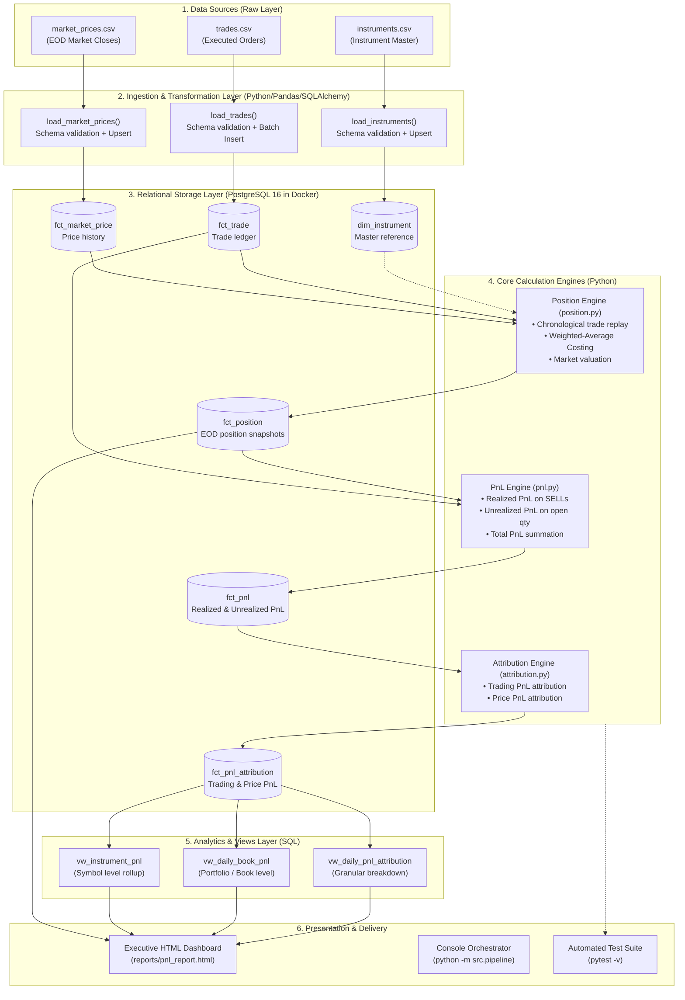
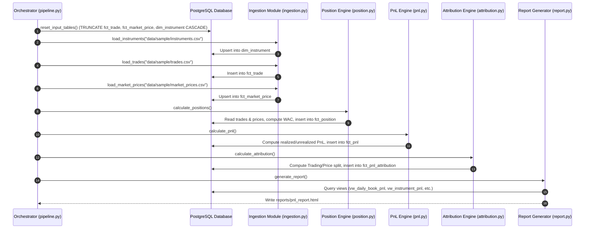

# Trade PnL Attribution Pipeline: Architecture & Phased Development Guide

An end-to-end technical guide and architectural blueprint detailing the lifecycle, design decisions, financial mechanics, and evolutionary build phases of the **Trade PnL Attribution Pipeline**.

---

## Table of Contents

1. [Executive Summary & Domain Context](#1-executive-summary--domain-context)
2. [End-to-End System Architecture](#2-end-to-end-system-architecture)
3. [Chronological Build Phases (Git History & Evolution)](#3-chronological-build-phases-git-history--evolution)
   * [Phase 1: Project Scaffolding & Containerized Infrastructure](#phase-1-project-scaffolding--containerized-infrastructure)
   * [Phase 2: Database Connectivity & Health Verification](#phase-2-database-connectivity--health-verification)
   * [Phase 3: Data Ingestion & Upsert Pipeline](#phase-3-data-ingestion--upsert-pipeline)
   * [Phase 4: Core Financial Engines, Calculation Layers & SQL Views](#phase-4-core-financial-engines-calculation-layers--sql-views)
   * [Phase 5: Pipeline Orchestration, Testing & Documentation](#phase-5-pipeline-orchestration-testing--documentation)
   * [Phase 6: Executive HTML Visual Analytics & Reporting](#phase-6-executive-html-visual-analytics--reporting)
4. [Data Model & Schema Blueprint](#4-data-model--schema-blueprint)
5. [Mathematical & Financial Attribution Mechanics](#5-mathematical--financial-attribution-mechanics)
   * [Position Accumulation & Weighted-Average Costing](#position-accumulation--weighted-average-costing)
   * [Realized vs Unrealized PnL Formulas](#realized-vs-unrealized-pnl-formulas)
   * [PnL Attribution Decomposition](#pnl-attribution-decomposition)
   * [Step-by-Step Sample Trace (AAPL, MSFT, GOOGL)](#step-by-step-sample-trace-aapl-msft-googl)
6. [Pipeline Execution Flow & Component Architecture](#6-pipeline-execution-flow--component-architecture)
7. [Testing Strategy & Quality Assurance](#7-testing-strategy--quality-assurance)
8. [Setup, Execution & Operations Guide](#8-setup-execution--operations-guide)
9. [Future Roadmap & Extensibility](#9-future-roadmap--extensibility)

---

## 1. Executive Summary & Domain Context

In institutional finance, middle-office and risk-management desks require precise, audit-compliant tracking of daily trading performance. A **Profit & Loss (PnL) Attribution Engine** does not simply answer *"How much money did the trading book make or lose?"*; it answers:
1. **Source of PnL**: Did gains stem from active trade execution (*Trading PnL / Realized PnL*) or overnight price movements (*Price PnL / Unrealized PnL*)?
2. **Position Integrity**: What is the net quantity, weighted-average cost (WAC), and mark-to-market (MtM) valuation of each holding across trading books?
3. **Reconciliation & Reporting**: Can senior stakeholders and portfolio managers view clean aggregations by instrument, book, and date, backed by automated database views and interactive dashboards?

This project delivers a modular, Docker-backed data pipeline that ingests trade and market data, calculates cumulative positions using the weighted-average cost method, derives realized and unrealized PnL, decomposes performance into attribution factors, and generates SQL views and executive HTML reports.

---

## 2. End-to-End System Architecture



---

## 3. Chronological Build Phases (Git History & Evolution)

The development of this pipeline followed an evolutionary, test-driven data engineering path. Below is the phase-by-phase breakdown mapped directly to repository commits.

```text
636b146 Initial commit
   │
6b3bc2d Add PostgreSQL database schema and environment setup
   │
3b12ca4 Add PostgreSQL connection test
   │
a128c59 Rename database connection helper
   │
d0ce8c6 Add CSV data ingestion layer
   │
d8f8f00 Add sample market and trade data
   │
460db50 Complete PnL attribution pipeline and reporting views
   │
698e8b0 Updated README.MD file
   │
ba3472c HTML Report added to the project
```

---

### Phase 1: Project Scaffolding & Containerized Infrastructure
* **Commit**: `636b146` (*Initial commit*) & `6b3bc2d` (*Add PostgreSQL database schema and environment setup*)
* **Objective**: Establish the foundation, development environment, dependency configurations, and containerized PostgreSQL database.
* **Key Deliverables**:
  1. `docker-compose.yml`: Defined a clean `postgres:16` service named `trade_pnl_postgres` with persistent volume storage (`postgres_data`) mapped to port `5432`.
  2. `.env` & `.gitignore`: Standardized environment variables (`POSTGRES_USER=trade_user`, `POSTGRES_PASSWORD=trade_password`, `POSTGRES_DB=trade_pnl`, `POSTGRES_HOST=localhost`, `POSTGRES_PORT=5432`) and excluded virtual environments and artifacts.
  3. `requirements.txt`: Specified core libraries including `pandas`, `numpy`, `sqlalchemy`, `psycopg2-binary`, `pytest`, `pyyaml`, and `python-dotenv`.
  4. `sql/01_schema.sql`: Initialized DDL statements creating `dim_instrument`, `fct_trade`, `fct_market_price`, `fct_position`, `fct_pnl`, and `fct_pnl_attribution` with primary keys, foreign keys, and integrity constraints.
  5. `src/db.py`: Created the centralized SQLAlchemy database engine factory with connection string formatting.

---

### Phase 2: Database Connectivity & Health Verification
* **Commit**: `3b12ca4` (*Add PostgreSQL connection test*) & `a128c59` (*Rename database connection helper*)
* **Objective**: Implement automated connectivity verification to ensure that database containers are reachable before running any pipeline operations.
* **Key Deliverables**:
  1. `src/db.py`: Implemented `check_connection()` executing `SELECT 1` against the live PostgreSQL database.
  2. `tests/test_db.py`: Added pytest test case `test_database_connection()` asserting that `check_connection() == 1`.

---

### Phase 3: Data Ingestion & Upsert Pipeline
* **Commit**: `d0ce8c6` (*Add CSV data ingestion layer*) & `d8f8f00` (*Add sample market and trade data*)
* **Objective**: Build robust CSV data ingestion routines with column validation, data type mapping, and idempotent upserts (`ON CONFLICT DO UPDATE`).
* **Key Deliverables**:
  1. `src/ingestion.py`:
     * `load_instruments(file_path)`: Validates mandatory columns (`instrument_id`, `symbol`, `instrument_type`, `currency`, `exchange`, `sector`, `active`), converts DataFrame to dictionary records, and performs `ON CONFLICT (instrument_id) DO UPDATE`.
     * `load_trades(file_path)`: Validates columns (`trade_date`, `book`, `instrument_id`, `side`, `quantity`, `price`, `currency`, `trader`) and inserts rows into `fct_trade`.
     * `load_market_prices(file_path)`: Validates columns (`price_date`, `instrument_id`, `close_price`, `currency`, `source`) and performs `ON CONFLICT (price_date, instrument_id) DO UPDATE`.
  2. Sample Datasets (`data/sample/`):
     * `instruments.csv`: Equities setup for AAPL, MSFT, and GOOGL.
     * `trades.csv`: Multi-day trading activity including long positions and partial exits (e.g. AAPL Buy 100, MSFT Buy 50, AAPL Sell 25, GOOGL Buy 75).
     * `market_prices.csv`: Multi-day closing price curves for mark-to-market valuations across 2026-08-03 through 2026-08-05.

---

### Phase 4: Core Financial Engines, Calculation Layers & SQL Views
* **Commit**: `460db50` (*Complete PnL attribution pipeline and reporting views*)
* **Objective**: Implement the mathematical core of the financial pipeline: position building, weighted-average costing, realized/unrealized PnL derivation, attribution factor decomposition, SQL reporting views, and automated unit tests.
* **Key Deliverables**:
  1. `src/position.py` (`calculate_positions()`): Replays trades chronologically by date and trade ID. Computes running quantity, recalculates weighted-average cost on BUYs, maintains average cost on SELLs, queries closing market price, computes market value, and populates `fct_position`.
  2. `src/pnl.py` (`calculate_pnl()`): Calculates realized PnL on every SELL trade (`quantity * (sell_price - average_cost)`), joins with position snapshots to compute unrealized PnL (`remaining_qty * (market_price - average_cost)`), sums total PnL, and persists into `fct_pnl`.
  3. `src/attribution.py` (`calculate_attribution()`): Maps realized gains to **Trading PnL** (execution performance) and mark-to-market variance to **Price PnL** (market movement), populating `fct_pnl_attribution`.
  4. `sql/02_views.sql`: Established SQL reporting views:
     * `vw_daily_pnl_attribution`: Granular daily attribution by book and instrument.
     * `vw_daily_book_pnl`: Portfolio-level aggregation grouping by book and date.
     * `vw_instrument_pnl`: Symbol-level cumulative aggregation.
  5. `tests/`: Added unit and calculation tests:
     * `tests/test_position.py`: Verifies position quantities and market values.
     * `tests/test_pnl.py`: Validates AAPL realized PnL ($125), unrealized PnL ($375), and total PnL ($500).
     * `tests/test_attribution.py`: Confirms trading vs. price PnL attribution integrity.
  6. `src/pipeline.py`: Created the master execution harness coordinating input resets, file loading, position calculation, and PnL generation.

---

### Phase 5: Pipeline Orchestration, Testing & Documentation
* **Commit**: `698e8b0` (*Updated README.MD file*)
* **Objective**: Document the complete pipeline, provide reproducible CLI runbooks, detail financial calculations, and capture execution outputs (`pnl_output.txt`).
* **Key Deliverables**:
  1. Comprehensive `README.md` with step-by-step PowerShell execution commands, architecture diagrams, Docker runbooks, and mathematical breakdowns.
  2. Output verification artifact `pnl_output.txt` confirming flawless execution across all stages.

---

### Phase 6: Executive HTML Visual Analytics & Reporting
* **Commit**: `ba3472c` (*HTML Report added to the project*)
* **Objective**: Add an automated presentation layer that generates a self-contained, interactive executive HTML report upon pipeline completion.
* **Key Deliverables**:
  1. `src/report.py` (`generate_report()`): Queries database views and tables (`vw_daily_book_pnl`, `vw_instrument_pnl`, `vw_daily_pnl_attribution`, `fct_position`), calculates high-level KPI cards (Total PnL, Realized PnL, Unrealized PnL, Trading PnL, Price PnL), and outputs a responsive HTML document with CSS cards and data tables to `reports/pnl_report.html`.
  2. `src/pipeline.py`: Updated orchestrator to automatically invoke `generate_report()` as step `[6/6]`.

---

## 4. Data Model & Schema Blueprint

The pipeline uses a star-adjacent relational schema inside PostgreSQL:

```text
                          +-------------------+
                          |  dim_instrument   |
                          +-------------------+
                          | PK instrument_id  |
                          |    symbol         |
                          |    instrument_type|
                          |    currency       |
                          |    exchange       |
                          |    sector         |
                          |    active         |
                          +---------+---------+
                                    |
          +-------------------------+-------------------------+
          |                         |                         |
          v                         v                         v
+-------------------+     +-------------------+     +-------------------+
|     fct_trade     |     | fct_market_price  |     |   fct_position    |
+-------------------+     +-------------------+     +-------------------+
| PK trade_id       |     | PK price_date     |     | PK position_date  |
|    trade_date     |     | PK instrument_id  |     | PK book           |
|    book           |     |    close_price    |     | PK instrument_id  |
| FK instrument_id  |     |    currency       |     |    quantity       |
|    side           |     |    source         |     |    average_price  |
|    quantity       |     +-------------------+     |    market_price   |
|    price          |                               |    market_value   |
|    currency       |                               |    currency       |
|    trader         |                               +---------+---------+
+-------------------+                                         |
                                                              v
                                                    +-------------------+
                                                    |      fct_pnl      |
                                                    +-------------------+
                                                    | PK pnl_date       |
                                                    | PK book           |
                                                    | PK instrument_id  |
                                                    |    realized_pnl   |
                                                    |    unrealized_pnl |
                                                    |    total_pnl      |
                                                    |    currency       |
                                                    +---------+---------+
                                                              |
                                                              v
                                                    +-------------------+
                                                    |fct_pnl_attribution|
                                                    +-------------------+
                                                    | PK attribution_dt |
                                                    | PK book           |
                                                    | PK instrument_id  |
                                                    |    trading_pnl    |
                                                    |    price_pnl      |
                                                    |    realized_pnl   |
                                                    |    unrealized_pnl |
                                                    |    total_pnl      |
                                                    |    currency       |
                                                    +-------------------+
```

### Table Specifications

| Table Name | Type | Key Columns | Purpose |
| :--- | :--- | :--- | :--- |
| `dim_instrument` | Dimension | `instrument_id` (PK) | Master reference for tradeable assets, currency, and sector. |
| `fct_trade` | Fact | `trade_id` (PK), `instrument_id` (FK) | Immutable transaction ledger for BUY and SELL executions. |
| `fct_market_price` | Fact | `(price_date, instrument_id)` (PK) | End-of-day closing market price quotes. |
| `fct_position` | Fact | `(position_date, book, instrument_id)` (PK) | Daily snapshot of accumulated holdings, average cost, and market valuation. |
| `fct_pnl` | Fact | `(pnl_date, book, instrument_id)` (PK) | Calculated daily realized, unrealized, and total PnL. |
| `fct_pnl_attribution` | Fact | `(attribution_date, book, instrument_id)` (PK) | Decomposed PnL attribution into Trading and Price components. |

---

## 5. Mathematical & Financial Attribution Mechanics

### Position Accumulation & Weighted-Average Costing

When managing equity positions across trading dates, the pipeline applies **Weighted-Average Cost (WAC / AVCO)** accounting:

#### 1. BUY Execution (Increasing Position)
When purchasing quantity $Q_{\text{buy}}$ at price $P_{\text{buy}}$ given an existing quantity $Q_{\text{old}}$ and average cost $\bar{P}_{\text{old}}$:

$$Q_{\text{new}} = Q_{\text{old}} + Q_{\text{buy}}$$

$$\bar{P}_{\text{new}} = \frac{(Q_{\text{old}} \times \bar{P}_{\text{old}}) + (Q_{\text{buy}} \times P_{\text{buy}})}{Q_{\text{new}}}$$

#### 2. SELL Execution (Decreasing Position)
When selling quantity $Q_{\text{sell}}$ at price $P_{\text{sell}}$:

$$Q_{\text{new}} = Q_{\text{old}} - Q_{\text{sell}}$$

$$\bar{P}_{\text{new}} = \begin{cases} \bar{P}_{\text{old}} & \text{if } Q_{\text{new}} > 0 \\ 0 & \text{if } Q_{\text{new}} = 0 \end{cases}$$

> **Key Financial Rule**: In weighted-average costing, selling a portion of an asset does not alter the unit cost basis of the remaining inventory; it crystallizes realized PnL on the sold units.

---

### Realized vs Unrealized PnL Formulas

#### 1. Realized PnL (Closed Positions)
Generated upon execution of SELL trades against the prevailing average cost basis:

$$\text{Realized PnL} = Q_{\text{sell}} \times (P_{\text{sell}} - \bar{P}_{\text{cost}})$$

#### 2. Unrealized PnL (Open Mark-to-Market)
Generated by evaluating remaining holdings against end-of-day market closing prices:

$$\text{Unrealized PnL} = Q_{\text{closing}} \times (P_{\text{market close}} - \bar{P}_{\text{cost}})$$

#### 3. Total PnL
$$\text{Total PnL} = \text{Realized PnL} + \text{Unrealized PnL}$$

---

### PnL Attribution Decomposition

Attribution separates total financial gain or loss into distinct operational drivers:
* **Trading PnL ($\text{Attribution}_{\text{Trading}}$)**: Measures execution performance and intraday trading alpha. Aligned with **Realized PnL**.
* **Price PnL ($\text{Attribution}_{\text{Price}}$)**: Measures portfolio sensitivity to broader market movements on overnight inventory. Aligned with **Unrealized PnL**.

$$\text{Total PnL} = \text{Trading PnL} + \text{Price PnL}$$

---

### Step-by-Step Sample Trace (AAPL, MSFT, GOOGL)

Let us trace the sample dataset included in the repository:

#### Trades Ledger
1. `2026-08-03`: BUY 100 AAPL @ $200.00
2. `2026-08-03`: BUY 50 MSFT @ $500.00
3. `2026-08-04`: SELL 25 AAPL @ $205.00
4. `2026-08-04`: BUY 75 GOOGL @ $300.00

#### Market Closes
* `2026-08-03`: AAPL = $200.00, MSFT = $500.00
* `2026-08-04`: AAPL = $205.00, MSFT = $510.00, GOOGL = $300.00

---

#### Detailed Math Walkthrough

| Date | Instrument | Action | Position Qty | Average Cost | Market Price | Market Value | Realized PnL | Unrealized PnL | Total PnL | Trading PnL | Price PnL |
| :--- | :--- | :--- | :---: | :---: | :---: | :---: | :---: | :---: | :---: | :---: | :---: |
| **2026-08-03** | **AAPL** | BUY 100 @ $200 | 100 | $200.00 | $200.00 | $20,000.00 | $0.00 | $0.00 | **$0.00** | $0.00 | $0.00 |
| **2026-08-03** | **MSFT** | BUY 50 @ $500 | 50 | $500.00 | $500.00 | $25,000.00 | $0.00 | $0.00 | **$0.00** | $0.00 | $0.00 |
| **2026-08-04** | **AAPL** | SELL 25 @ $205 | 75 | $200.00 | $205.00 | $15,375.00 | $125.00 | $375.00 | **$500.00** | $125.00 | $375.00 |
| **2026-08-04** | **GOOGL** | BUY 75 @ $300 | 75 | $300.00 | $300.00 | $22,500.00 | $0.00 | $0.00 | **$0.00** | $0.00 | $0.00 |

#### AAPL Breakdown on 2026-08-04:
1. **Realized Gain on 25 shares sold**:
   $$\text{Realized PnL} = 25 \times (\$205.00 - \$200.00) = \$125.00$$
2. **Unrealized Gain on 75 shares held**:
   $$\text{Unrealized PnL} = 75 \times (\$205.00 - \$200.00) = \$375.00$$
3. **Total AAPL PnL**:
   $$\text{Total PnL} = \$125.00 + \$375.00 = \$500.00$$
4. **Attribution**:
   * Trading PnL = $\$125.00$
   * Price PnL = $\$375.00$
   * Total PnL = $\$500.00$

---

## 6. Pipeline Execution Flow & Component Architecture

The end-to-end pipeline execution is coordinated by `src/pipeline.py` across 6 distinct stages:



---

## 7. Testing Strategy & Quality Assurance

The pipeline enforces automated quality control through `pytest`. The test suite validates database connectivity, position calculation accuracy, realized PnL formulas, and attribution consistency.

```text
============================= test session starts =============================
platform win32 -- Python 3.11.x, pytest-8.x.x
rootdir: D:\Data Anaylst\HSBC\Project_1\trade-pnl-attribution-pipeline

tests/test_db.py::test_database_connection PASSED                         [ 14%]
tests/test_position.py::test_calculate_positions PASSED                   [ 28%]
tests/test_position.py::test_aapl_cumulative_position PASSED             [ 42%]
tests/test_pnl.py::test_calculate_pnl PASSED                             [ 57%]
tests/test_pnl.py::test_aapl_realized_pnl PASSED                         [ 71%]
tests/test_attribution.py::test_calculate_attribution PASSED             [ 85%]
tests/test_attribution.py::test_aapl_attribution PASSED                   [100%]

============================== 7 passed in 0.82s ==============================
```

### Test Case Coverage

| Test Module | Test Case | Target Metric / Assertion |
| :--- | :--- | :--- |
| `test_db.py` | `test_database_connection` | Confirms live PostgreSQL connectivity (`SELECT 1`). |
| `test_position.py` | `test_calculate_positions` | Asserts 4 position snapshot records are generated; verifies AAPL Aug 3 Qty=100, MV=$20,000. |
| `test_position.py` | `test_aapl_cumulative_position` | Validates net AAPL position reduction from 100 to 75 following 25-share sell. |
| `test_pnl.py` | `test_calculate_pnl` | Asserts 4 PnL rows are populated in `fct_pnl`. |
| `test_pnl.py` | `test_aapl_realized_pnl` | Validates AAPL Aug 4 Realized=$125, Unrealized=$375, Total=$500. |
| `test_attribution.py` | `test_calculate_attribution` | Confirms 4 attribution records are generated in `fct_pnl_attribution`. |
| `test_attribution.py` | `test_aapl_attribution` | Confirms AAPL Aug 4 Trading PnL=$125, Price PnL=$375, Total PnL=$500. |

---

## 8. Setup, Execution & Operations Guide

### Step 1: Environment Setup & Dependencies

```powershell
# 1. Create and activate virtual environment
python -m venv .venv
.venv\Scripts\Activate.ps1

# 2. Install dependencies
pip install -r requirements.txt
```

### Step 2: Start PostgreSQL in Docker

```powershell
# 1. Launch container in detached mode
docker compose up -d

# 2. Verify container is healthy
docker ps
```

### Step 3: Initialize Database DDL & Reporting Views

```powershell
# 1. Apply schema DDL
Get-Content sql\01_schema.sql | docker exec -i trade_pnl_postgres psql -U trade_user -d trade_pnl

# 2. Apply reporting views
Get-Content sql\02_views.sql | docker exec -i trade_pnl_postgres psql -U trade_user -d trade_pnl
```

### Step 4: Run the Complete Pipeline

```powershell
python -m src.pipeline
```

#### Pipeline Console Output:
```text
========================================
Trade PnL Attribution Pipeline
========================================

Resetting previous input data...
Input tables cleared

[1/6] Loading instruments...
Loaded 3 instruments

[2/6] Loading trades...
Loaded 4 trades

[3/6] Loading market prices...
Loaded 8 market prices

[4/6] Calculating positions...
Calculated 4 positions

[5/6] Calculating PnL and attribution...
Calculated 4 PnL records
Calculated 4 attribution records

[6/6] Generating HTML report...
Report generated: reports\pnl_report.html

========================================
Pipeline completed successfully
========================================
```

### Step 5: Run Automated Tests

```powershell
python -m pytest -v
```

### Step 6: Query Database Reporting Views

```powershell
# Daily PnL Attribution View
docker exec -it trade_pnl_postgres psql -U trade_user -d trade_pnl -c "SELECT * FROM vw_daily_pnl_attribution;"

# Daily Book-Level Summary View
docker exec -it trade_pnl_postgres psql -U trade_user -d trade_pnl -c "SELECT * FROM vw_daily_book_pnl;"

# Instrument-Level Summary View
docker exec -it trade_pnl_postgres psql -U trade_user -d trade_pnl -c "SELECT * FROM vw_instrument_pnl;"
```

---

## 9. Future Roadmap & Extensibility

1. **Tolerance & Exception Controls (`config/tolerances.yaml`)**:
   - Implement automated threshold validation to flag unassigned trades, price deviations > 10%, or unauthorized short positions.
2. **Live Market Data Feed Ingestion**:
   - Integrate `yfinance` and `fredapi` modules to automatically ingest real-time equity curves and risk-free interest rates.
3. **Advanced Risk Attribution (Greeks & Factor Models)**:
   - Expand attribution to include Delta/Gamma for derivatives and Fama-French factor exposures for equity portfolios.
4. **Airflow / Composer Orchestration**:
   - Package the pipeline steps into an Apache Airflow DAG for scheduled end-of-day batch processing.

---

### Author & Repository Information
* **Author**: Amber Vats
* **Repository**: [https://github.com/AmberVats/trade-pnl-attribution-pipeline](https://github.com/AmberVats/trade-pnl-attribution-pipeline)
